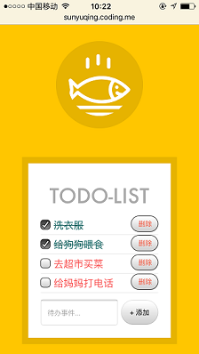

## todoList

* 利用HTML、css3、es6实现的待办事项小应用。
* 使用localStorage存储数据到本地。
* 详细的代码注释(样式注释写在stylus里面)。
* 实现如下功能：
    * 添加事件
    * 删除事件
    * 标记已处理事件

### 技术清单 ：

  1. localStorage--储存数据
  2. css3--样式，如transition
  3. es6--箭头函数等
  4. stylus--书写样式
  5. gulp--编译打包等自动化构建

### 项目截图

   

### 在线预览

   [在线demo](http://sunyuqing.coding.me/todolist)
